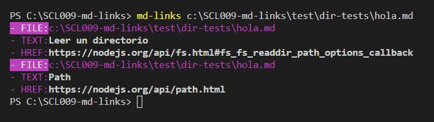
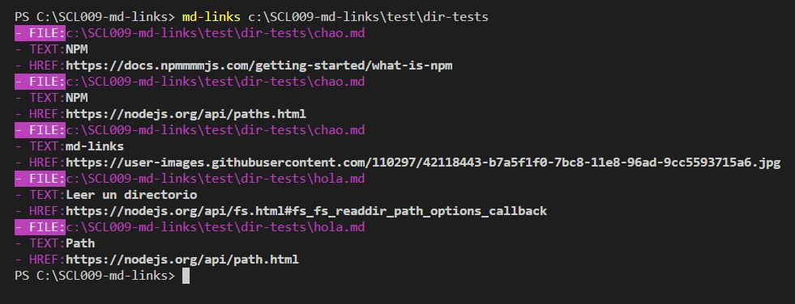
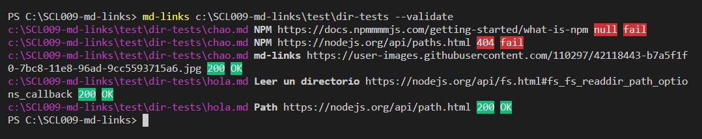
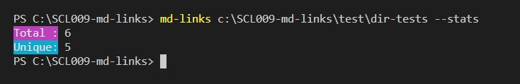
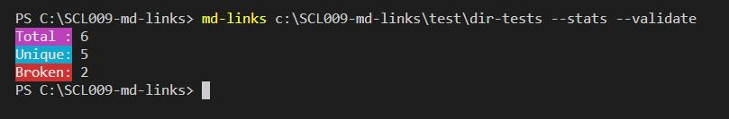
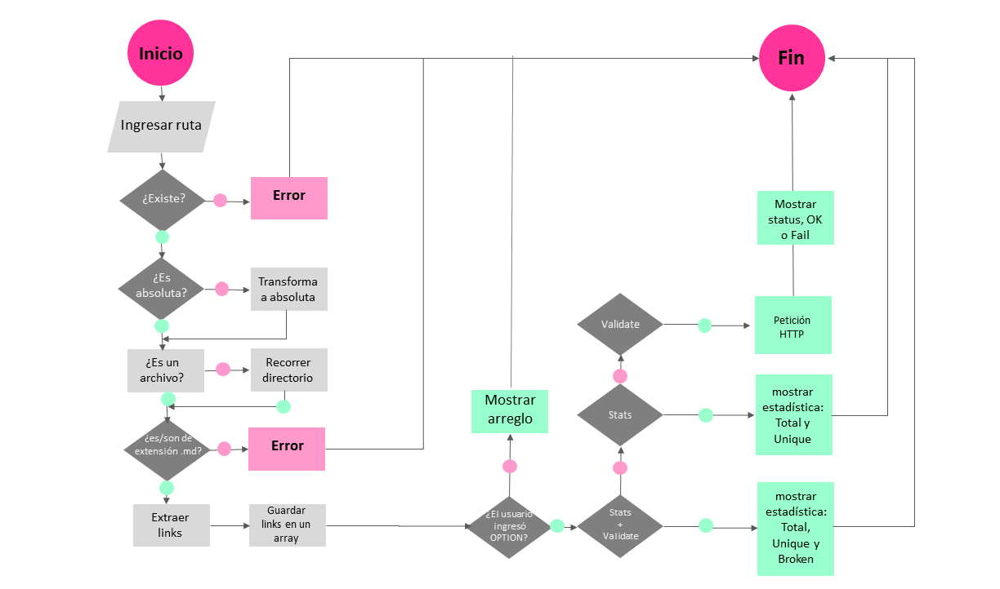

# gm-md-links
<a href="https://www.npmjs.com/package/gm-md-links"></a>

Lee y analiza archivos en formato `Markdown`, verifica los links y reporta algunas estadísticas.

## Instalación

```
npm install gm-md-links
```
## Como usar

En el archivo JS:

```js
const mdlinks = require('gm-md-links');   
```

En la terminal:

```
md-links <path-to-file> [options]
```

**CLI (Command Line Interface)**

**PATH**

* Para leer archivos con extensión .md

`md-links <path-to-file.md>`



* Leer un directorio

`md-links <path-to-directory>`



En ambos casos, se obtiene como resultado:

- `file`: archivo o ruta donde fue encontrado el link.
- `href`: link encontrado.
- `text`: descripción del link.

**OPTIONS**

**--validate**

Entrega la validacion o status de los links (status: 200, 404, etc). Por ejemplo:

`md-links <path-to-file.md> --validate`



**--stats**

Entrega la seguiente estadística: 
`Total -` el total de links encontrados;
`Unique -` el total de links unicos.

`md-links <path-to-file.md> --stats`



**--stats --validate**

Las dos opiciones combinadas, además de `Total` y `Unique`, agregan la seguiente estadística: 
`Broken -` el total de links rotos;

`md-links <path-to-file.md> --stats --validate`



## Documentación técnica

### Dependencias:

- node.js versión 11
- node-fetch: 2.6.0
- chalk: 2.4.2
- filehound: 1.17.0
- marked: 0.6.2
- jest: 24.7.1
- eslint: 6.0.1

### Planificación:

* **Diagrama de Flujo**:



*  **Trello**:

El board con el backlog de la implementación de la librería puede ser encontrado [aquí.](https://trello.com/b/nYJHHPKY/mdlinkd)


## Autor

[Giselle Machado](https://github.com/gisellem22)
